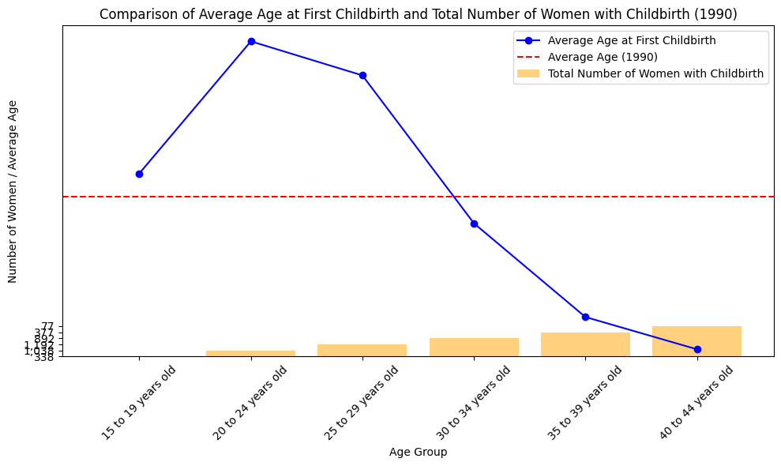

HW4 CS625
================
Sujitha Cherukuthota

# Dataset - 1

# Dataset Cleaning

I did my dataset set cleaning using Open refine and I also did manually
for some changes. The columns which contains strings are converted into
numeric format. I also removed the unwanted characters from the dataset.
After cleaning the dataste and mnually editing I saved it as a CSV file.

## Question 1

**Q1: Compare the ages of women at the time of the birth of their first child between 1990-2008. For instance, is there any evidence that women in the US are waiting longer to have their first child?**

ANS: I did two charts for this question one is line graph and other one
is mutiple line graph. I created both graphs to understand crealy. Line
graph actually shows the change in time period I think this line graph
is beat choice for this question to show the time period change.

'''
# Plotting

plt.figure(figsize=(12, 6))
sns.lineplot(x=average_age_first_birth.index,
y=average_age_first_birth.values, marker=‘o’, label=‘Average Age at
First Childbirth’) for age_group in total_births_by_age_group.index:
sns.lineplot(x=total_births_by_age_group.columns,
y=total_births_by_age_group.loc\[age_group\], marker=‘o’, label=f’Total
{age_group}’)

plt.xlabel(‘Year’) plt.ylabel(‘Count’) plt.title(‘Comparison of Average
Age at First Childbirth and Total Births by Age Group (1990-2008)’)
plt.legend(title=‘Age Group’) plt.grid(True) plt.show()

'''

**1st Graph**

Idiom: Multiple Line Chart / Mark: Line \| Data: Attribute \| Data:
Attribute Type \| Encode: Channel \| \| — \|—\| — \| \| Average Age at
Birth \| value, quantitative \| vertical spatial region (y-axis) \| \|
Year \| value, Temporal \| horizontal position on a common scale
(x-axis) \| \| Age of mother \|value, categorical \|

**2nd Graph**

Idiom: Multiple Line Chart / Mark: Line \| Data: Attribute \| Data:
Attribute Type \| Encode: Channel \| \| — \|—\| — \| \| Count \| value,
quantitative \| vertical spatial region (y-axis) \| \| Year \| value,
Temporal \| horizontal position on a common scale (x-axis) \| \| Count
\|value, categorical \|

## Question 2

**How does this compare to the number of women in each age group who had a child (not necessarily their first) in that year? What does this say about the age of women giving birth in the US?**

ANS: As I described in above question I choose line graph for this
question too because Line grapgh shows the time period changes clearly.
Here I am using different colours to represent Average age at first
child, Average age and Total number of women with childbirth to
understand clearly.

'''
**Plotting the comparison**
plt.figure(figsize=(10, 6))
plt.plot(data['Age of mother'], data['1990_First_Births'], marker='o', label='Average Age at First Childbirth', color='b')
plt.bar(data['Age of mother'], data['1990_Total_Births'], alpha=0.5, label='Total Number of Women with Childbirth', color='orange')

plt.axhline(y=average_age_first_birth, color='r', linestyle='--', label='Average Age (1990)')
plt.xlabel('Age Group')
plt.ylabel('Number of Women / Average Age')
plt.title('Comparison of Average Age at First Childbirth and Total Number of Women with Childbirth (1990)')
plt.xticks(rotation=45)
plt.legend()
plt.tight_layout()
plt.show()
'''
Idiom: Multiple Line Chart / Mark: Line
| Data: Attribute | Data: Attribute Type  | Encode: Channel | 
| --- |---| --- |
| Number of women/Average Age | value, quantitative | vertical spatial region (y-axis) |
| Age Group| value, Temporal | horizontal position on a common scale (x-axis) |
| Number of women/Average Age |value, categorical | Hue |

## Further Questions:

**What further questions does this prompt? What hypotheses do you have
about what the answers might be? Are there other tables that might help
you address these questions?**

ANS: Question: Are there regional disparities in the average age at
first childbirth? 

Due to factors such as education and career
opportunities, regions with higher socioeconomic status may have a
higher average age at first childbirth.

Question: How does educational attainment affect the average age at
first childbirth? 

Women with higher levels of education may postpone
childbirth to pursue their careers or personal goals, resulting in a
higher average age at first childbirth.

# Extra Credits

**Combine the data from Tables 91 and 92 (Women Who Have Had a Child in the Last Year By Selected Characteristics) to investigate other factors that affect this.**

ANS: We can investigate various factors such as education, marital
status, ethnicity, and employment that influence when women choose to
have children by combining data from Tables 91 and 92. Looking at these
factors together helps us understand why women choose to have children.
For example, we can investigate whether education level influences
childbirth timing or employment status.

# Reference

<https://seaborn.pydata.org/>

Link to Python colab:
<https://colab.research.google.com/drive/1Bb9h0ew2kp5VStji5avP9OFULXlvDFQl?usp=sharing>
